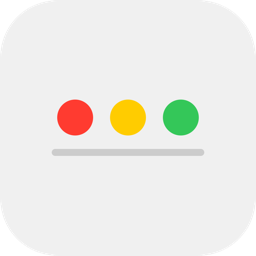
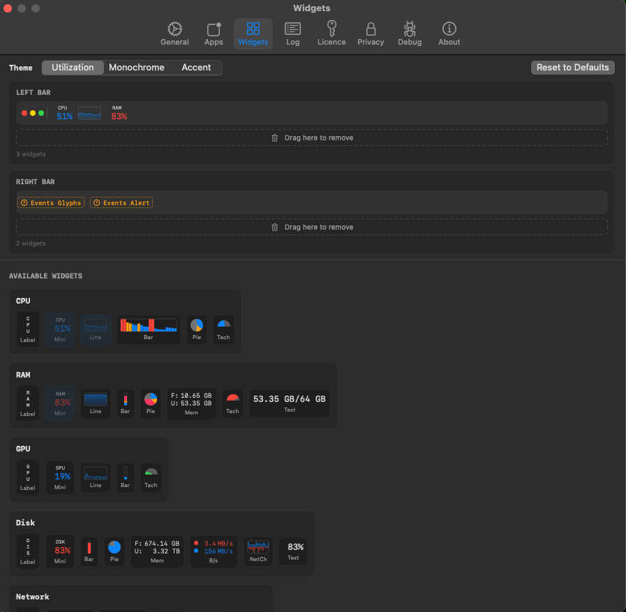
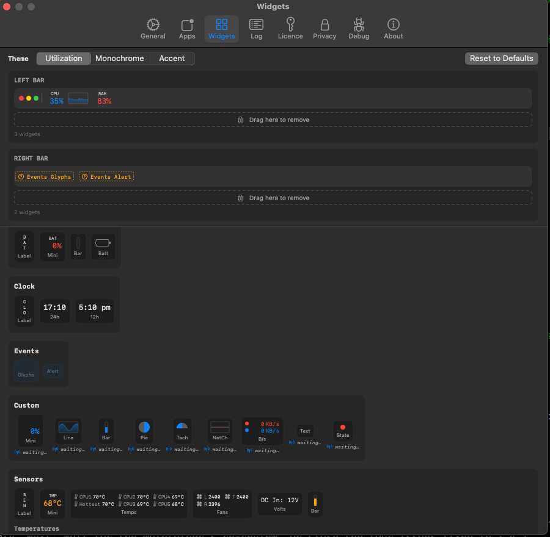
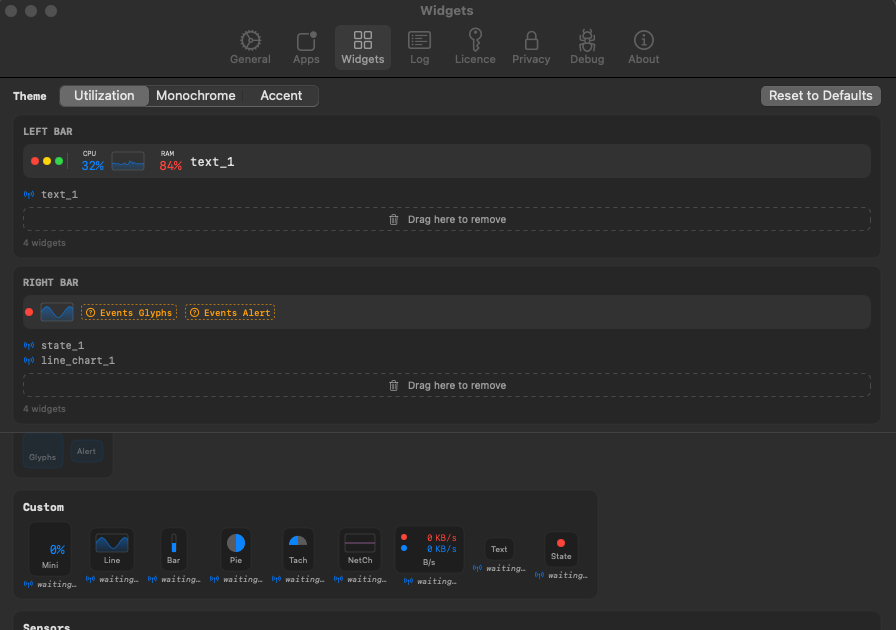
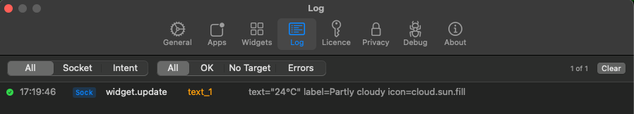
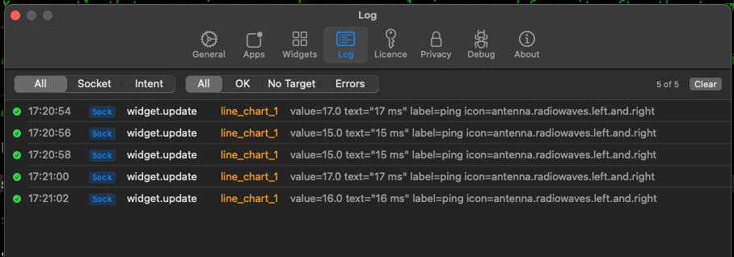
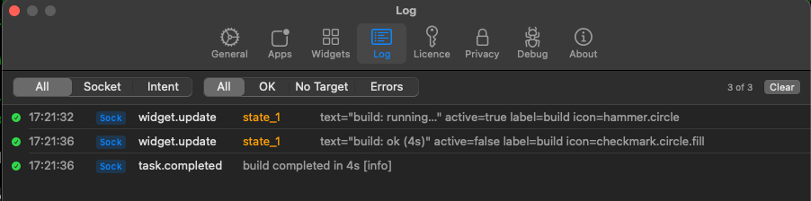
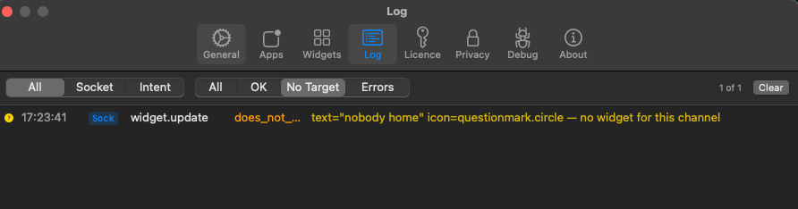

<p align="center">
  <a href="https://appbar.app"></a>
</p>

# AppBar community examples

Working scripts that push real signals into the [AppBar](https://appbar.app)
overlay. Each one is short, self-contained, and safe to copy-paste, modify, and
drop into your own setup.

AppBar: **https://appbar.app**

Every example here follows three rules:

- **Read-only.** Nothing reads or writes your configuration. Scripts that surface
  Claude Code usage parse your local transcripts; 
- **No required setup beyond a widget.** 
 no extra installs.
- **Standard tools only.** Just `bash` plus tools that ship on every macOS and
  are not deprecated — `awk`, `plutil`, `curl`, `find`, `grep`, `sort`, `date`,
  `sed`, `tr`, `osascript`.

## Prerequisites

1. AppBar installed and running — get it at [appbar.app](https://appbar.app).
2. Install the `appbar` CLI from **AppBar → Settings** — there's a button that
   adds the `appbar` command for you. The socket is installed while running
3. For each example, add the matching **Custom** widget in **Settings →
   Widgets**. AppBar auto-names the first Custom widget of each type — the first
   Text widget becomes channel `text_1`, the first Line Chart `line_chart_1`,
   and so on. The examples target those default channel names. You will nbeed to add them to the default setup in the widgets section using the custom section.

### Adding the widgets

Open **Settings → Widgets**:



Scroll to the **Custom** section and drag a **Text**, **Line Chart**, or
**State** widget onto a bar:



Once added, each shows its auto-assigned channel name — `text_1`, `state_1`,
`line_chart_1` — the names the examples target:



## The examples

| Directory | What it does | Add this widget | Channel |
|---|---|---|---|
| [`hello-world/`](hello-world/hello.sh) | Smallest possible push — proves the pipe works | Text | `text_1` |
| [`claude-code/`](claude-code/session.sh) | Your current Claude Code 5-hour session: tokens used + when it resets (read-only, from transcripts) | Text | `text_1` |
| [`ping-latency/`](ping-latency/ping-latency.sh) | Graphs round-trip latency to a host | Line Chart | `line_chart_1` |
| [`run-status/`](run-status/run-status.sh) | Wraps any command; shows running → done and fires an alert | State | `state_1` |
| [`now-playing/`](now-playing/now-playing.sh) | Current Apple Music track (AppleScript bridge) | Text | `text_1` |
| [`weather/`](weather/weather.sh) | Current temperature + condition icon (keyless, via wttr.in) | Text | `text_1` |

Each script's header comment lists its exact setup and usage.

## Seeing what's sent — the Log tab

**Settings → Log** records every push, so you can see exactly what reached
AppBar and where it went. Filter by **OK**, **No Target**, or **Errors**.

A text push (`weather` → `text_1`):



A line-chart push (`ping-latency` → `line_chart_1`):



A state widget plus its event (`run-status` → `state_1`):



Pushed to a channel with no widget — accepted, but flagged **No Target** (this
is why nothing shows up if you forgot to add the widget):



## Quick start

```sh
# 1. add a Custom + Text widget in Settings → Widgets  (becomes text_1)
# 2. run:
./hello-world/hello.sh
```

You should see "hello, AppBar" appear in the title bar of a focused,
allow-listed app. From there, try the others.

## A note on `--value`

`appbar widget --value N` is for **gauge/chart** widgets only: line/bar charts
plot it, and mini/tachometer widgets read it as a **0–1 fraction** (rendered as
a percentage). Plain readings like a temperature or a track name belong in
`--text`, not `--value` — pushing `13.4` to a mini gauge shows `1340%`, not
`13°C`.

## Adding your own

Pick a default channel for the widget type you want, add that widget in
Settings → Widgets, and start pushing with `appbar widget` / `appbar emit`. The
existing scripts are short enough to crib structure from.

## Contributing

Want to add an example? See [CONTRIBUTING.md](CONTRIBUTING.md).
