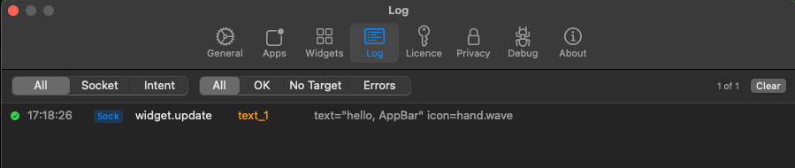

# The Log tab

**Settings → Log** records every push, so you can see exactly what reached
AppBar and where it went. Filter by **OK**, **No Target**, or **Errors**.

Everything arrives over the same Unix socket, so both the `appbar` CLI and a
direct socket write (like [`hello-socket/`](../hello-socket/hello-socket.sh))
show up tagged **Sock** — the log can't tell them apart, because the CLI is just
writing to that socket for you.

A plain text push (`hello-world` → `text_1`):

A text push carrying a label + icon (`weather` → `text_1`):

A line-chart push (`ping-latency` → `line_chart_1`):

A state widget plus its event (`run-status` → `state_1`):

Pushed to a channel with no widget — accepted, but flagged **No Target** (this
is why nothing shows up if you forgot to add the widget):

